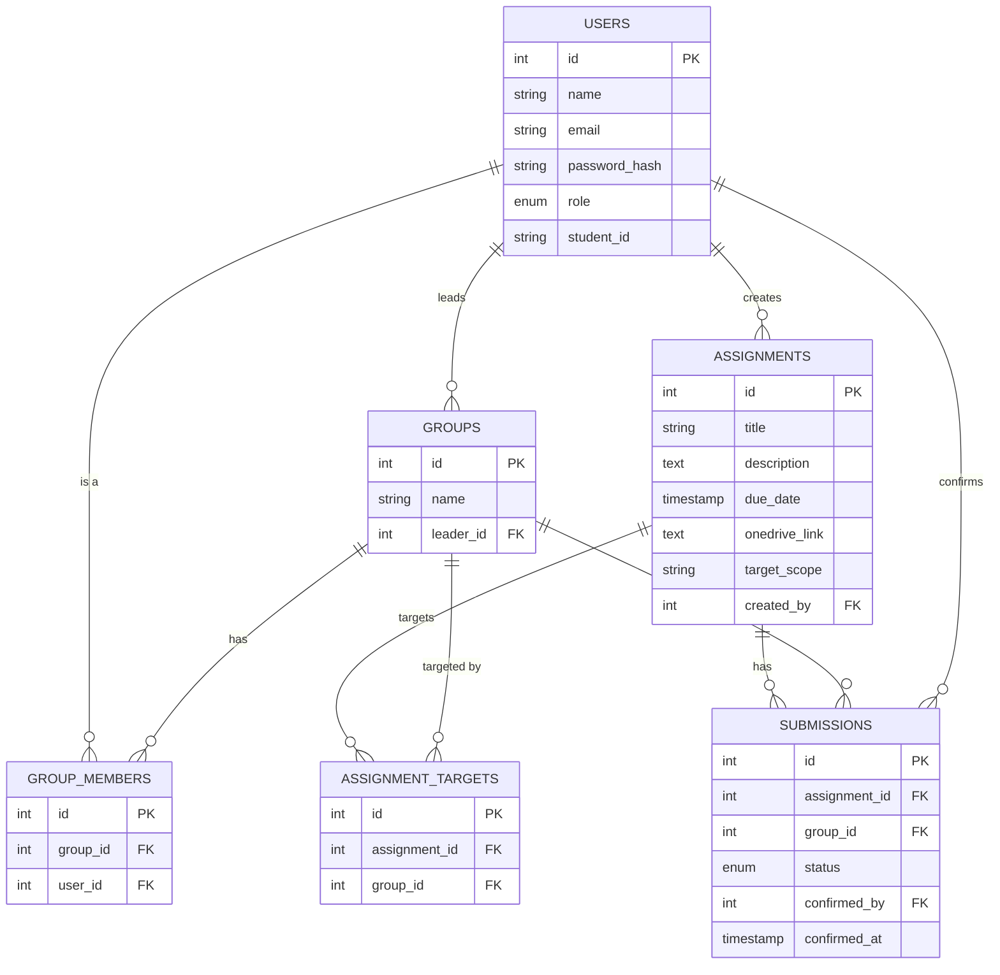

# Joineazy — Student, Group & Assignment Management System

A role-based full-stack app for Joineazy: students form their own groups and confirm
assignment submissions; professors post assignments and track group progress.

## 1. Overview of Implementation

- **Frontend:** React (Vite) + Tailwind CSS. Two role-based dashboards (Student / Admin)
  behind a shared login, with a `ProtectedRoute` wrapper that checks the JWT-decoded role.
- **Backend:** Node.js + Express, REST API, PostgreSQL via `pg` (raw parameterized SQL,
  no ORM — chosen for transparency of the relational logic, which is the point being
  evaluated here).
- **Auth:** JWT, `bcryptjs` for password hashing. One `users` table with a `role` enum
  (`student` / `admin`) rather than separate tables — both roles authenticate identically,
  they just get different permissions and views.
- **Two-step submission confirmation:** implemented as UI state (`pending → confirm`
  dialog before the API call fires) rather than a separate backend endpoint, since the
  "two-step" requirement is about preventing accidental clicks, not a two-phase server
  transaction. The server call itself is a single atomic status flip.
- **Containerization:** Docker Compose spins up Postgres, backend, and frontend together.

## 2. Architecture

```
┌─────────────┐      REST/JSON       ┌──────────────┐      SQL       ┌────────────┐
│   React SPA │ ───────────────────▶ │ Express API  │ ──────────────▶│ PostgreSQL │
│ (Vite+Tail) │ ◀─────────────────── │  (JWT auth)  │ ◀───────────── │            │
└─────────────┘     JWT in header     └──────────────┘                └────────────┘
     :5173                                  :5000                         :5432
```

- Frontend never talks to Postgres directly; everything goes through the Express API.
- JWT is stored in `localStorage` and attached via an axios interceptor.
- `requireAuth` middleware verifies the token; `requireRole('admin'|'student')` gates
  role-specific endpoints (e.g. only admins can `POST /assignments`, only students can
  `POST /groups`).

## 3. Database Schema & Relationships

See [`backend/src/db/schema.sql`](backend/src/db/schema.sql) for the full DDL.



*(GitHub renders this diagram automatically when viewing this file. If you're reading it elsewhere, paste the block into the [Mermaid Live Editor](https://mermaid.live).)*

**Key design decision:** a `submissions` row is pre-created (status `pending`) for every
(assignment, group) pair the moment an assignment is posted, rather than only on
confirmation. This means "not yet submitted" is a real row the admin dashboard can count,
not an absence to infer — which is what makes the group-wise and assignment-wise progress
queries a single `COUNT(...) FILTER (...)` instead of a subtraction against total groups.

## 4. API Endpoints

| Method | Endpoint | Role | Description |
|---|---|---|---|
| POST | `/api/auth/register` | Public | Register as student or admin |
| POST | `/api/auth/login` | Public | Log in, returns JWT |
| GET | `/api/auth/me` | Any | Current user profile |
| POST | `/api/groups` | Student | Create a group (creator becomes leader + first member) |
| POST | `/api/groups/:groupId/members` | Student (leader) | Add a member by email or student ID |
| DELETE | `/api/groups/:groupId/members/:userId` | Student (leader) | Remove a member (not the leader) |
| POST | `/api/groups/:groupId/leave` | Student (member) | Leave a group you don't lead |
| DELETE | `/api/groups/:groupId` | Student (leader) | Delete the group entirely |
| GET | `/api/groups/mine` | Student | Groups the student belongs to |
| GET | `/api/groups/:groupId/members` | Any | List a group's members |
| GET | `/api/groups` | Admin | All groups, with member counts |
| POST | `/api/assignments` | Admin | Create assignment (target: all or specific groups) |
| PUT | `/api/assignments/:id` | Admin | Edit an assignment |
| DELETE | `/api/assignments/:id` | Admin | Delete an assignment |
| GET | `/api/assignments/mine` | Student | Assignments visible to the student |
| GET | `/api/assignments` | Admin | All assignments |
| POST | `/api/submissions/:assignmentId/groups/:groupId/confirm` | Student (member) | Final confirm (step 2) |
| GET | `/api/submissions/groups/:groupId/progress` | Any | A group's submission progress + percent |
| GET | `/api/submissions/:assignmentId` | Admin | Per-group status for one assignment |
| GET | `/api/submissions/:assignmentId/students` | Admin | Student-wise status for one assignment (every student in a targeted group, with their group's confirmation status) |
| GET | `/api/analytics/overview` | Admin | Totals + per-assignment + per-group completion |

All protected routes expect `Authorization: Bearer <token>`. Request bodies are
validated with `express-validator`; malformed input returns `400` with a
`details` array (field + message) instead of reaching the database layer.

## 5. Setup & Run Instructions

### With Docker (recommended)
```bash
cp backend/.env.example backend/.env
docker compose up --build
```
- Frontend: http://localhost:5173
- Backend: http://localhost:5000/api
- Postgres auto-runs `schema.sql` on first boot.
- Optionally seed demo data: `docker compose exec backend npm run seed`

### Without Docker
```bash
# Postgres: create a local db named "joineazy", then:
cd backend
cp .env.example .env   # point DB_HOST at localhost
npm install
npm run migrate        # applies schema.sql
npm run seed            # optional: demo admin/students/groups/assignments
npm run dev

# in a second terminal
cd frontend
npm install
npm run dev
```

### Demo login (after `npm run seed`)
All accounts use password `password123`.
| Role | Email | Notes |
|---|---|---|
| Admin | `prof@joineazy.dev` | Posted both demo assignments |
| Student | `divya@joineazy.dev` | Leader of Team Alpha |
| Student | `aarav@joineazy.dev` | Member of Team Alpha |
| Student | `riya@joineazy.dev` | Leader of Team Beta |

### Running tests
```bash
cd backend
npm install
npm test
```
18 tests across auth, JWT/role middleware, and group/assignment validation —
the database layer is mocked (`jest.mock('../src/db/pool')`), so no Postgres
instance is required to run them.

### Verification status
This scaffold has been verified in the sandbox that generated it: `npm install`
succeeds for both frontend and backend, every backend file passes `node --check`,
`npm test` passes (18/18), the Express server boots and answers a real HTTP
request to `/api/health`, and `npm run build` produces a clean Vite production
bundle with no compile errors. **Not verified**: an actual `docker compose up`
against a real Postgres instance — no Docker daemon was available in the
sandbox this was built in, so treat the Docker path as untested (the plain
Node.js path above has been exercised directly and is a safe fallback if
`docker compose up` surfaces an issue).

## 6. Key Design & Deployment Decisions

- **Single `users` table with a role enum** instead of separate `students`/`admins`
  tables — simpler auth, and a professor never needs student-only fields.
- **Groups are reusable, not per-assignment** — students form a group once; admins later
  target assignments at existing groups, matching how the problem statement describes it.
- **Pre-created submission rows** (see §3) so "who hasn't submitted yet" is queryable
  without a join against every group.
- **Raw SQL over an ORM** — makes the relational logic (and the transactions used when
  creating a group or an assignment) explicit and easy to explain in an interview.
- **Docker Compose over a single Dockerfile** — mirrors how this would actually be
  deployed (separate frontend/backend/DB services, e.g. on Render or Railway), and lets
  the DB be swapped for a managed instance in production by just changing `DB_HOST`.
- **Submission is a group action, tracked at the student level too** — confirming
  submission updates one row per (assignment, group), but the admin's student-wise view
  (`GET /submissions/:assignmentId/students`) joins through `group_members` so every
  student's status is visible individually, not just their group's.
- **Members can be added by email or student ID** — `addMember` accepts either, matching
  the spec's "via student email or ID," and the group page exposes both as a toggle.
- **Completion badges** (`Not Started` / `In Progress` / `Completed`) sit alongside every
  progress bar, computed client-side from the percent the API already returns — no extra
  backend state needed.
- **Admin analytics uses real bar charts** (Recharts) for completion-by-assignment and
  completion-by-group, in addition to the numeric summaries, satisfying the "basic charts
  or summary counts" requirement with both.
- **Group deletion is leader-only and cascades** — deleting a group removes its
  memberships, assignment targets, and submission rows via `ON DELETE CASCADE` in the
  schema, so there's no orphaned data to clean up manually. The leader can't remove
  themselves or leave (`deleteGroup` is the only way to end a group they lead), keeping
  "every group has exactly one leader" invariant simple to reason about.
- **Validation lives in a middleware chain, not in controllers** — `validators.js` defines
  `express-validator` rule chains per route, and `handleValidation` turns any failure into
  a consistent `400` before the controller runs. Controllers stay focused on business logic.
