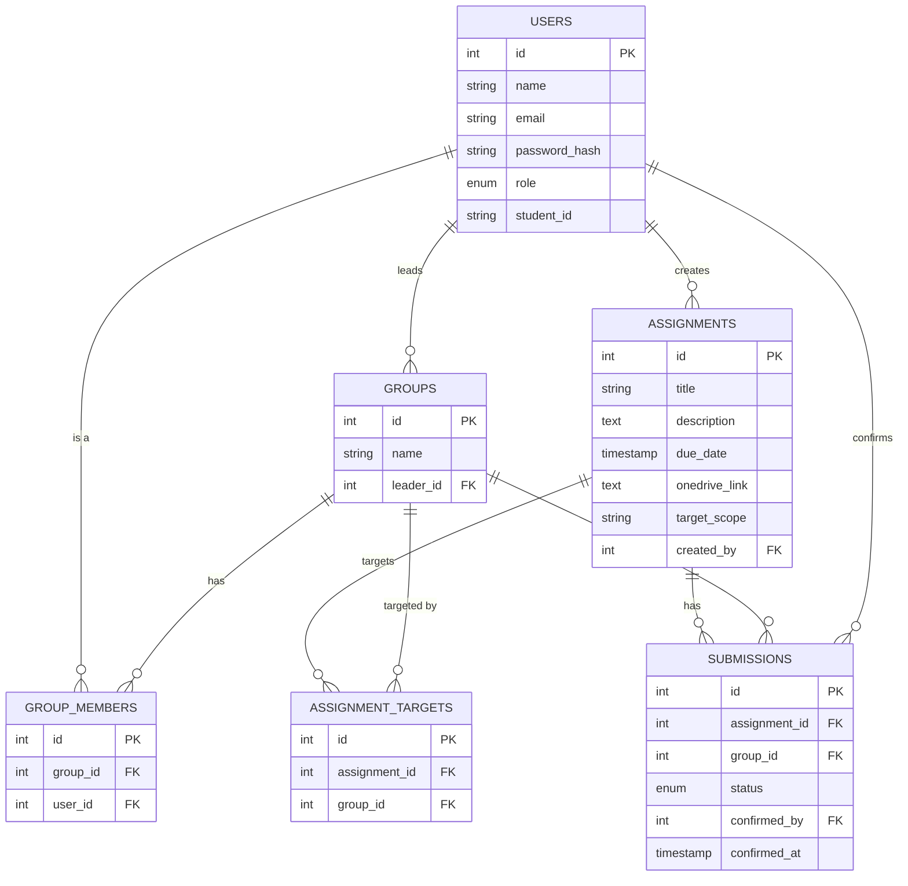

# Joineazy — Student, Group & Assignment Management System

A role-based app for managing student groups and assignment submissions. Students form
their own groups and confirm when they've submitted; professors post assignments and
keep an eye on which groups are behind.

Built as a full-stack project: React on the frontend, Express/PostgreSQL on the backend,
no ORM.

## What it does

- Students sign up, create a group (they become the leader automatically), and add
  teammates by email or student ID.
- Professors post assignments — either to every group at once, or to a specific list of
  groups — with a due date and a link to the assignment resources.
- Submitting isn't a file upload. A group member marks the assignment as submitted, then
  confirms it in a second step. It's basically a two-click "yes, we're done" that's hard
  to trigger by accident.
- Professors get a tracking view per assignment (which groups/students have confirmed)
  and an analytics page with completion stats and a couple of charts.

## Stack

- **Frontend** — React (Vite) + Tailwind. One shared login screen, two dashboards
  (student / admin) behind a `ProtectedRoute` that reads the role out of the JWT.
- **Backend** — Node + Express, REST API. PostgreSQL via `pg` directly — no Prisma/Sequelize.
  I went with raw parameterized SQL on purpose here, mostly so the relational logic (joins,
  transactions when creating a group/assignment) stays visible instead of hidden behind an
  ORM layer.
- **Auth** — JWT + bcrypt. One `users` table with a `role` enum (`student`/`admin`) rather
  than two separate tables, since both roles log in the same way and only differ in what
  they're allowed to do afterward.
- **Docker** — `docker-compose.yml` spins up Postgres, backend, and frontend as three
  services.

## Architecture

```
┌─────────────┐      REST/JSON       ┌──────────────┐      SQL       ┌────────────┐
│   React SPA │ ───────────────────▶ │ Express API  │ ──────────────▶│ PostgreSQL │
│ (Vite+Tail) │ ◀─────────────────── │  (JWT auth)  │ ◀───────────── │            │
└─────────────┘     JWT in header     └──────────────┘                └────────────┘
     :3000                                  :5000                         :5432
```

The frontend never touches Postgres directly, everything goes through the API. The token
lives in `localStorage` and gets attached to every request via an axios interceptor.
`requireAuth` checks the token is valid; `requireRole('admin' | 'student')` gates the
routes that are role-specific (only admins can post assignments, only students can create
groups, etc).

## Database

Full DDL is in [`backend/src/db/schema.sql`](backend/src/db/schema.sql). Roughly:



*(GitHub renders this automatically. If you're viewing it somewhere that doesn't, paste
the block into [Mermaid Live](https://mermaid.live).)*

One decision worth calling out: a `submissions` row gets created for every
(assignment, group) pair the moment the assignment is posted — status `pending` —
instead of only creating a row once someone confirms. That way "hasn't submitted yet" is
just a row sitting there, not something the admin dashboard has to infer by comparing
against the group count. Makes the progress queries a single `COUNT(...) FILTER (...)`.

## API

| Method | Endpoint | Role | Description |
|---|---|---|---|
| POST | `/api/auth/register` | Public | Register as student or admin |
| POST | `/api/auth/login` | Public | Log in, returns JWT |
| GET | `/api/auth/me` | Any | Current user profile |
| POST | `/api/groups` | Student | Create a group (creator becomes leader + first member) |
| POST | `/api/groups/:groupId/members` | Student (leader) | Add a member by email or student ID |
| DELETE | `/api/groups/:groupId/members/:userId` | Student (leader) | Remove a member (not the leader) |
| POST | `/api/groups/:groupId/leave` | Student (member) | Leave a group you don't lead |
| DELETE | `/api/groups/:groupId` | Student (leader) | Delete the group entirely |
| GET | `/api/groups/mine` | Student | Groups the student belongs to |
| GET | `/api/groups/:groupId/members` | Any | List a group's members |
| GET | `/api/groups` | Admin | All groups, with member counts |
| POST | `/api/assignments` | Admin | Create assignment (target: all or specific groups) |
| PUT | `/api/assignments/:id` | Admin | Edit an assignment |
| DELETE | `/api/assignments/:id` | Admin | Delete an assignment |
| GET | `/api/assignments/mine` | Student | Assignments visible to the student |
| GET | `/api/assignments` | Admin | All assignments |
| POST | `/api/submissions/:assignmentId/groups/:groupId/confirm` | Student (member) | Final confirm (step 2) |
| GET | `/api/submissions/groups/:groupId/progress` | Any | A group's submission progress + percent |
| GET | `/api/submissions/:assignmentId` | Admin | Per-group status for one assignment |
| GET | `/api/submissions/:assignmentId/students` | Admin | Student-wise status for one assignment |
| GET | `/api/analytics/overview` | Admin | Totals + per-assignment + per-group completion |

All protected routes need `Authorization: Bearer <token>`. Bad input gets caught by
`express-validator` before it reaches the database — you get a `400` with a `details`
array (field + message) instead of a stack trace.

## Running it

### Env vars

There's no `.env.example` checked in yet, so just create `backend/.env` yourself:

```
PORT=5000
JWT_SECRET=replace-me-with-something-long
DB_HOST=localhost
DB_PORT=5432
DB_USER=postgres
DB_PASSWORD=postgres
DB_NAME=joineazy
FRONTEND_URL=http://localhost:3000
```

`FRONTEND_URL` matters more than it looks — it's what the backend's CORS check allows.
The frontend actually runs on **port 3000** (see `vite.config.js`), not 5173, so make sure
this is set correctly or you'll get CORS errors instead of a login screen. This tripped
me up once already — see Known Issues below.

### With Docker

```bash
docker compose up --build
```
- Frontend: http://localhost:3000 (docker-compose currently maps `5173:5173`, which is
  stale — see below)
- Backend: http://localhost:5000/api
- Postgres runs `schema.sql` automatically on first boot.
- Seed some demo data: `docker compose exec backend npm run seed`

### Without Docker

```bash
# create a local Postgres db called "joineazy" first, then:
cd backend
npm install
npm run migrate     # applies schema.sql
npm run seed         # optional — demo admin/students/groups/assignments
npm run dev

# separate terminal
cd frontend
npm install
npm run dev
```

### Demo logins (after `npm run seed`)

Everyone's password is `password123`.

| Role | Email | Notes |
|---|---|---|
| Admin | `prof@joineazy.dev` | Posted most of the demo assignments |
| Admin | `riyer@joineazy.dev` | Posted the rest |
| Student | `divya@joineazy.dev` | Leader of Team Alpha |
| Student | `aarav@joineazy.dev` | Member of Team Alpha |
| Student | `riya@joineazy.dev` | Leader of Team Beta |
| Student | `rohan@joineazy.dev` | Leader of Team Gamma |
| Student | `neha@joineazy.dev` | Leader of Team Delta |

(there are a few more seeded students spread across the four groups if you want a
fuller-looking demo)

### Tests

```bash
cd backend
npm test
```

18 tests, covering auth, the JWT/role middleware, and group/assignment validation. The
DB layer is mocked (`jest.mock('../src/db/pool')`), so you don't need a real Postgres
instance running just to run the suite.

## Known issues

- **Port mismatch.** `docker-compose.yml` and `frontend/Dockerfile` both still reference
  port 5173 for the frontend, but `vite.config.js` runs the dev server on 3000. Works fine
  running frontend/backend separately outside Docker since you just hit whatever port Vite
  actually printed, but the Docker port mapping needs fixing (`5173:5173` → `3000:3000`)
  before `docker compose up` will expose the right port.
- The Docker path hasn't been tested end-to-end against a real Postgres container by me
  yet — I've only run the plain `npm run dev` setup locally. If `docker compose up`
  misbehaves, the non-Docker steps above are the safe fallback.

## A few design decisions, in case anyone's wondering why

**Why one `users` table instead of separate `students`/`admins` tables?** Simpler auth,
and honestly a professor account never needs student-only fields like `student_id`, so a
single `role` column does the job without the extra join.

**Why are groups reusable instead of created per-assignment?** Because that's how it
actually works in a classroom — students pick teammates once at the start of a project,
and every assignment after that just targets the groups that already exist.

**Why no ORM?** Wanted the SQL — especially the transactions in `createGroup` and
`createAssignment` — to be readable without having to know Prisma/Sequelize conventions.
Also just prefer knowing exactly what query is hitting the database.

**Submission tracking is per-group, but the admin view shows students too.** Confirming a
submission updates one row per (assignment, group) — it's a group action. But
`GET /submissions/:assignmentId/students` joins through `group_members` so a professor
can still see every individual student's status, not just their group's, which matters
if you're trying to figure out who in an unconfirmed group needs a nudge.

**Group deletion cascades and is leader-only.** Deleting a group wipes its memberships,
assignment targets, and submission rows via `ON DELETE CASCADE` — no orphaned rows to
clean up by hand. The leader can't leave or remove themselves; deleting the group is the
only way out, which keeps "every group has exactly one leader" simple to reason about
everywhere else in the code.

**Validation lives in middleware, not controllers.** `validators.js` has the
`express-validator` rule chains per route, `handleValidation` turns any failure into a
consistent `400` before the controller even runs. Keeps controllers focused on what
they're actually supposed to do.
